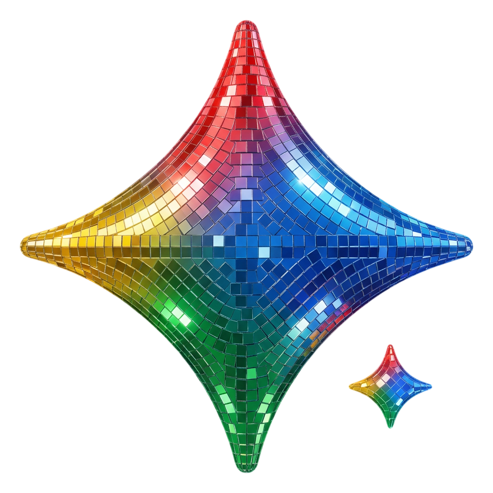

<p align="center">
  
</p>

<div align="center">

# Unwatermark

### Remove Google Gemini AI watermarks — instantly, privately, in your browser.

**Web App · Browser Extension · 100% Open Source**

<br>

<a href="https://microsoftedge.microsoft.com/addons/detail/nlfhgjjionkpldaikdlhmjhhpkjnpmle">
  
</a>

</div>

## What is this?

**Unwatermark** is both a **web app** and a **browser extension** that automatically removes embedded Gemini AI watermarks from images — using pure mathematics, entirely in your browser.

- **Web App** → Upload any Gemini image, get a clean PNG instantly
- **Browser Extension** → Watermarks vanish automatically when you click download on Gemini

No servers. No uploads. Zero data collection. Everything runs locally.

## Web App

### Live Demo

Visit the live website to upload and clean any Gemini AI image directly in your browser.

### How to Run Locally

```bash
node server.js
```

Open `http://localhost:5000` in your browser.


## How It Works — Reverse Alpha Blending

Gemini applies its watermark using alpha compositing. This project mathematically reverses the process pixel by pixel.

**Watermarked pixel model:**

$$C_{watermarked} = \alpha \cdot C_{logo} + (1 - \alpha) \cdot C_{original}$$

**Recovery formula:**

$$C_{original} = \frac{C_{watermarked} - \alpha \cdot C_{logo}}{1 - \alpha}$$

Where:
- $C_{original}$ — restored pixel value
- $C_{watermarked}$ — visible watermarked pixel
- $\alpha$ — per-pixel transparency from precomputed watermark template
- $C_{logo}$ = **255** (Gemini watermark is white)

Two watermark size variants are handled automatically:
- **48×48** — images ≤ 1024px on either dimension
- **96×96** — images > 1024×1024px

## Before and After

<table align="center">
<tr>
<td align="center">
<b>Before (With Watermark)</b><br><br>

</td>
<td align="center">
<b>After (Watermark Removed)</b><br><br>

</td>
</tr>

<tr>
<td align="center">

</td>
<td align="center">

</td>
</tr>
</table>

## Browser Extension

### Install on Microsoft Edge (Recommended)

Available directly on the Microsoft Edge Add-ons Store — link above.

### Install on Google Chrome

Download the `.crx` from the `releases/` folder:

1. Open `chrome://extensions`
2. Enable **Developer Mode**
3. Drag and drop `GeminiWRv2.0.1.crx` onto the page
4. Confirm installation

> [!WARNING]
> If Chrome blocks the CRX, use **Load unpacked** instead and select the project folder.

### Manual Load Unpacked (Chrome & Edge)

1. Open `chrome://extensions` or `edge://extensions`
2. Enable **Developer Mode**
3. Click **Load unpacked**
4. Select the project root folder

## Features

| Feature | Web App | Extension |
|---|---|---|
| No server uploads | ✅ | ✅ |
| Lossless PNG output | ✅ | ✅ |
| Auto watermark detection | ✅ | ✅ |
| 48×48 + 96×96 variants | ✅ | ✅ |
| No account required | ✅ | ✅ |
| Works offline | ✅ | ✅ |
| Auto on Gemini download | ❌ | ✅ |
| Any image file | ✅ | ❌ |

## Privacy

- No personal data collected
- No image uploads to any server
- No external network requests during processing
- No analytics or telemetry
- Everything runs fully locally on your device
